# Linux Essentials

---

### **0. Initial Setup**

First I made sure that everything is up to date and then installed some necessary packages

```
apt update && apt upgrade -y
apt install sudo adduser iputils-ping netcat-openbsd net-tools vim curl -y
```

Since initially I am the **root** user I decided it would be wise to create a normal user just to make sure I don't accidentaly run dangerous commands

```
adduser robert
usermod -aG sudo robert # add the new user to the sudo group since we'll still probably need to run admin commands
su robert # switch to newly created user
```

### **1. Lookup the Public IP of cloudflare.com**

```
nslookup cloudflare.com
```

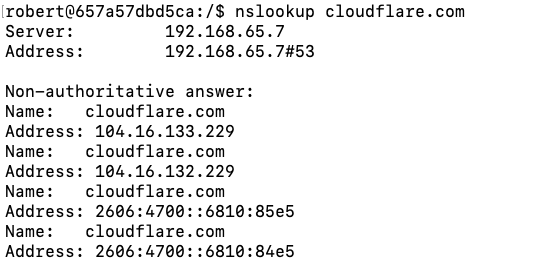

### **2. Map IP address 8.8.8.8 to hostname google-dns**

I wanted to initially see what happens when I run `ping google-dns`. I got nothing. Then I mapped google-dns to 8.8.8.8 inside the hosts file and did `ping google-dns` again.

```
ping google-dns
echo "8.8.8.8 google-dns" | sudo tee -a /etc/hosts
ping google-dns
```

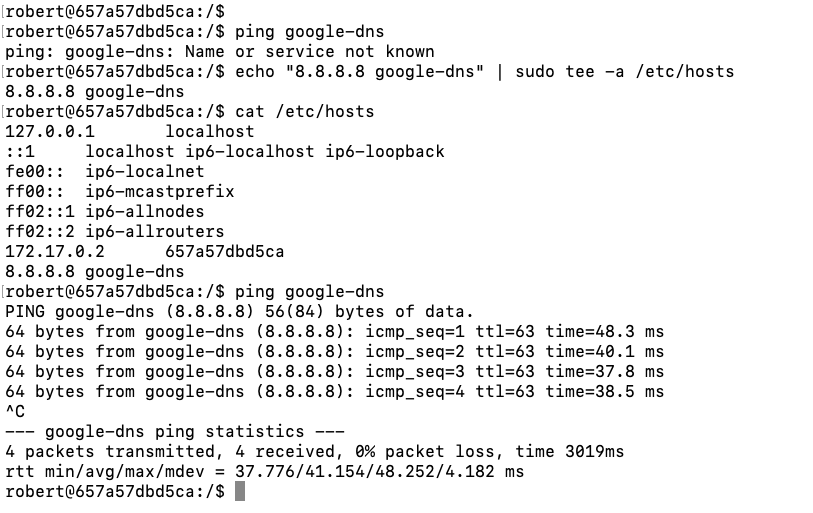

### **3. Check if the DNS Port is Open for google-dns**

Port 53 is the default DNS Port
I used netcat to attempt to connect to google-dns on port 53.

```
nc -zv google-dns 53
```

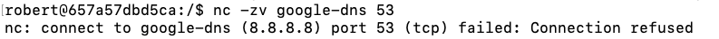
The connection was refused so I can assume that the DNS Port is **closed**.

### **4. Modify the System to Use Google’s Public DNS**

- **Change the nameserver to 8.8.8.8 instead of the default local
  configuration.**

  I changed the nameserver inside the resolv.conf file

  ```
  echo "nameserver 8.8.8.8" | sudo tee /etc/resolv.conf
  ```

  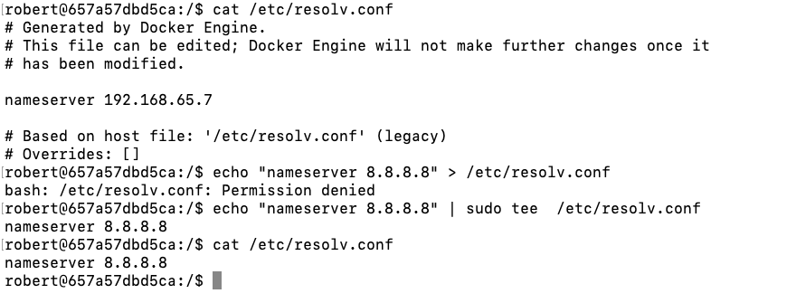

- **Perform another public IP lookup for cloudflare.com and compare the
  results.**

  I ran another IP lookup and the results seem to still be the same.

  New Results:

  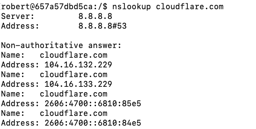

  Original Results:

  

### **5. Install and verify that Nginx service is running**

```
sudo apt install nginx -y
sudo service nginx start
service nginx status

```

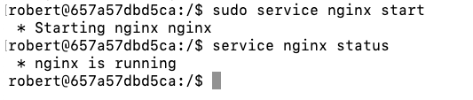

### **6. Find the Listening Port for Nginx**

I used netstat -tulnp to get all listening connections and then filtered them with grep to only show connections related to Nginx

```
netstat -tulnp | grep nginx
```

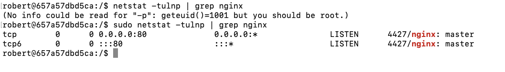

The listening port for Nginx is **80**

## Bonus

### **7. Change the Nginx Listening port to 8080**

I access the Nginx config file and edit the port there

```
sudo vim /etc/nginx/sites-available/default
```

Initial:

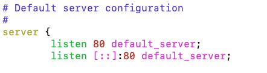

Edited:

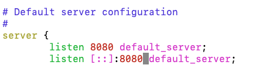

Then I restart Nginx and check for it's listening port again

```
sudo service nginx stop
sudo service nginx start
netstat -tulnp | grep nginx
```

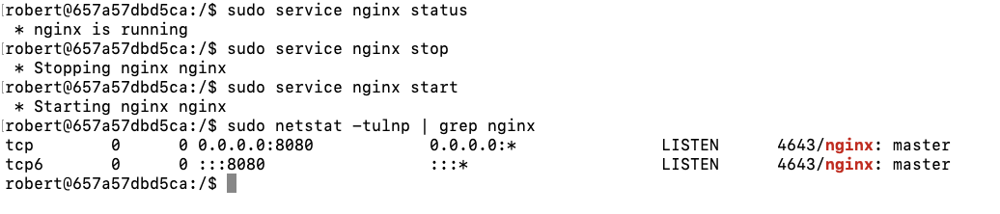
I access the default Nginx HTML page and edit it
```
sudo vim /var/www/html/index.nginx-debian.html
```

Initial:

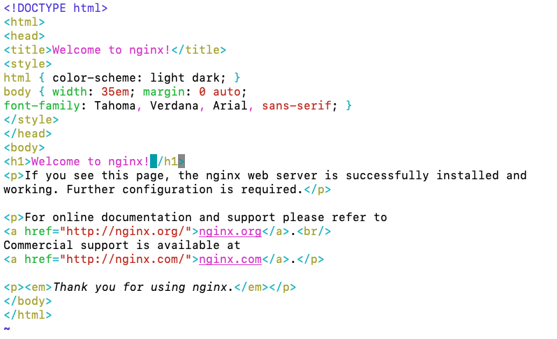

Edited:

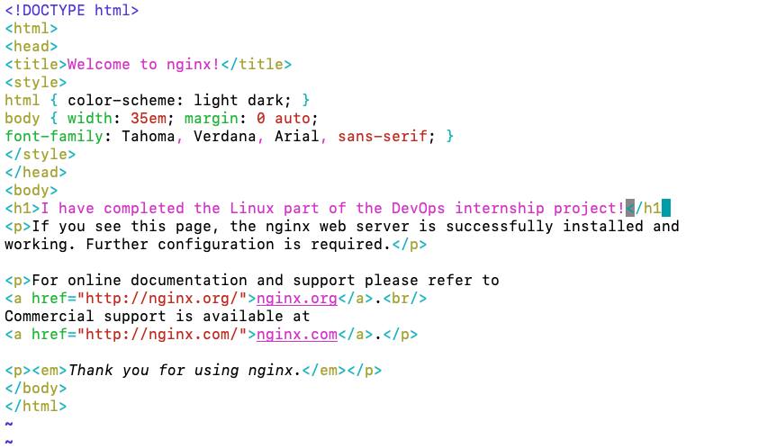

Then I access it with curl to see if it actually changed
```
curl http://localhost:8080
```

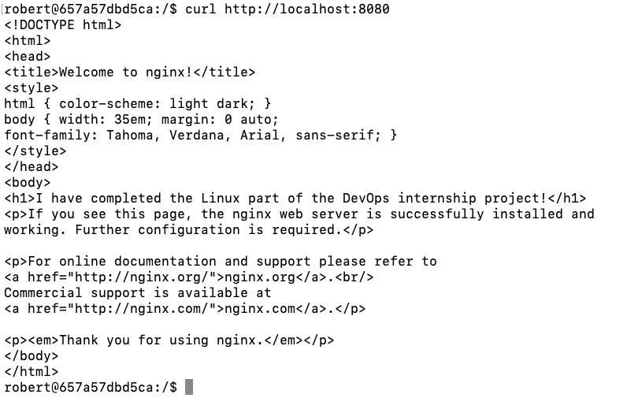