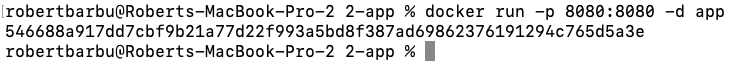
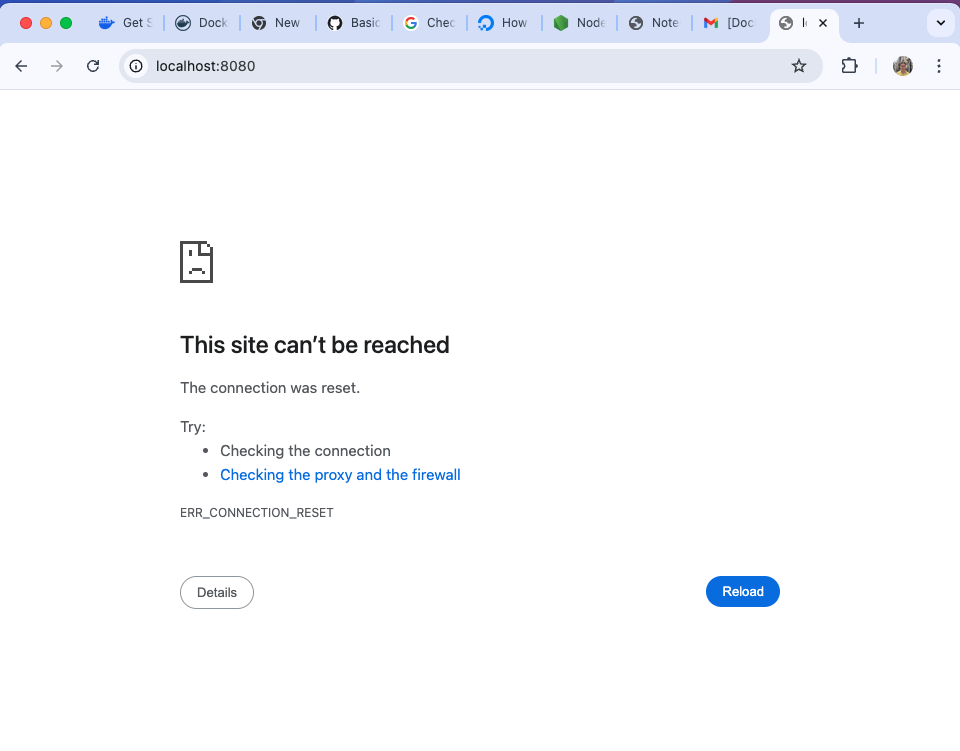

# Application Part

### Creating and Running the Image

Building the image

```
cd ./app-2
docker build -t app .
```

Running the image

```
docker run -p 8080:8080 -d app
```

I map the port 8080 of the container to the 8080 port of my pc usign `-p 8080:8080`


The returned string is the Container ID.

### Testing

The first thing I do is I check if the container is actually running

```
docker ps
```


And there is no **app** container, so we have a problem.
I then use Container ID received when I ran it to check the logs.

```
docker logs <container-id>
```


Inside the logs I can observe that we miss a dependenciy: express.
Then I check the package.json file and observe that indeed we don't have any depenendcies


I add express to the dependencies.


Now I will build the image again and run it and then check `docker ps`

```
docker build -t app .
docker run -p 8080:8080 app
docker ps
```


Success! Now the container runs. I'll try to access the app inside the browser now.



It seems like the app is not working. Let's check the logs of the container with `docker logs <container-id>`


It seems like the application is running but on port 3030. I have to modify the notes.js file


First I will stop the current container (because it runs on port 8080 and If we are to try to run the new modified one on the same port we won't be able to actually do it)
Now I will build the image and run it again. Then I'll check the browser again


Finally, everything works as intended!

## Bonus

### Configure environment variables for sensitive information
