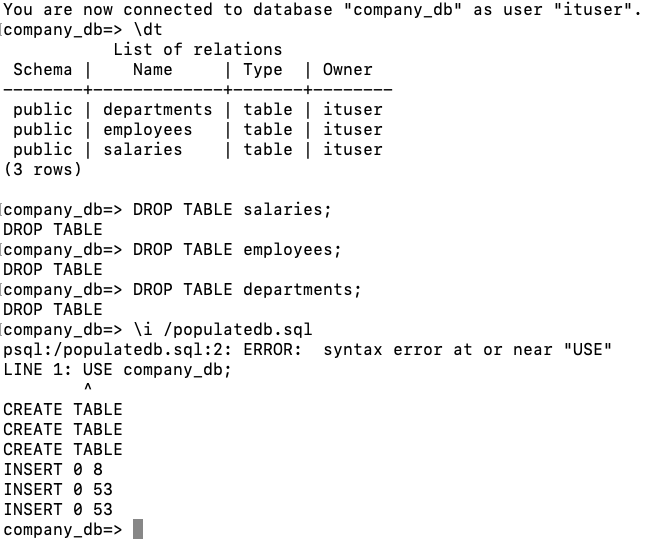

# Database Part

### Pull and run a PostgreSQL container.
```
docker run --name postgres-container -e POSTGRES_PASSWORD=robi -d postgres
docker exec -it postgres-container bash 
psql -U postgres
```
- Create a database called "company_db".
- Do not use the default user, instead use one called "ituser".
```
CREATE USER ituser WITH PASSWORD 'password';
ALTER USER ituser CREATEDB;
\c postgres ituser
CREATE DATABASE company_db;
\c company_db ituser
```


### Create a dataset using the sql script provided in the folder 3-db/
First I copy the sql script into my container.
```
docker cp ./populatedb.sql postgres-container:/populatedb.sql
```


Then I run it inside psql
```
\i /populatedb.sql
```


It seems like we have some errors. The most concerning one being the one related to the salaries table. The insert failed because we don't have an employee with id 54; Actually we have only 53 employees and about 76 salaries. I will modify the sql script to have only 53 salaries and run it again.



Great!

### Run the following SQL queries:
- Find the total number of employees.
  ```
  SELECT COUNT(*) FROM employees;
  ```
  
  

- Retrieve the names of employees in a specific department (prompt for user
  input).
  ```
  SELECT first_name || ' ' || last_name AS name
  FROM employees
  WHERE department_id = 1;
  ```
  
  

- Calculate the highest and lowest salaries per department.
    ```
    SELECT department_name, MAX(salary) AS highest_salary, MIN(salary) AS lowest_salary
    FROM employees
    JOIN departments ON employees.department_id = departments.department_id
    JOIN salaries ON employees.employee_id = salaries.employee_id
    GROUP BY department_name;
    ```

   
### Dump the dataset into a file
```
pg_dump -U ituser -d company_db -f /data.sql
```


### Bash Script
0. Run your container
   ```
   docker run --name postgres-container -e POSTGRES_PASSWORD=robi -d postgres
   ```
1. Copy the script into your container
   ```
   cd path/to/3-db
   docker cp ./script.sh postgres-container:/script.sh
   ```
2. Access the container, give execution permission to your script and run it
   ```
   docker exec -it postgres-container bash
   chmod +x /script.sh 
   /script.sh
   ```
3. Select the department for the 2nd SQL query

   

4. Check query results

   